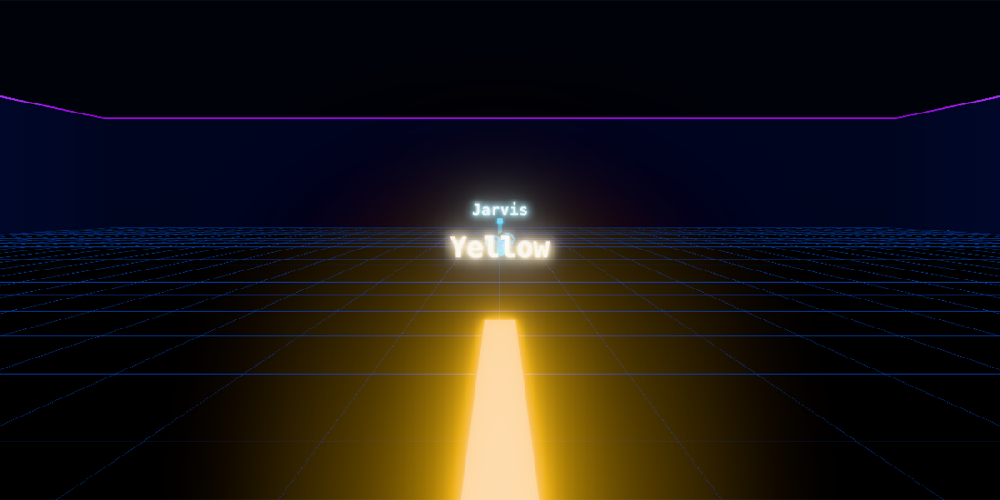
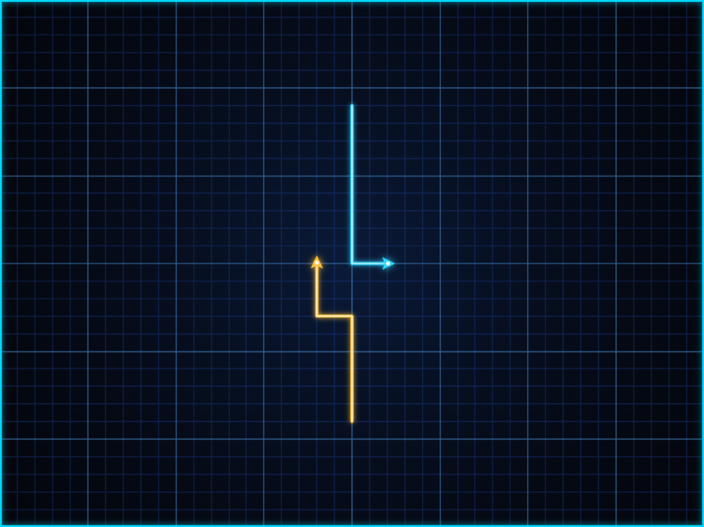

# Lightcycle Arena

A Tron-style lightcycle game: leave a wall behind you, don't ride into one.
Five programs are waiting, and the last two don't just try to survive — they
carve the arena in half and take your side of it.

**Play → [tron-lightcycle.web.app](https://tron-lightcycle.web.app/)**



Built with React, TypeScript and three.js. Same game, two views.



---

## How to play

Pick a view from the title screen:

| | |
| --- | --- |
| **2D Classic** | The whole board at once. Arrows are compass headings. |
| **3D Cockpit** | A chase camera behind your bike, with a minimap in the corner. Left and right **turn the bike**, because from back there that is what they have to mean. |
| **2 Players** | Two riders sharing one keyboard: arrows against WASD. |

- **Esc** or **P** pauses. Switching tabs pauses too, rather than letting the
  round run on without you.
- **R** restarts the round — and costs a life, so it can't be used to dodge a
  crash you were about to have.
- A rider who goes down takes their wall with them, the way a derezzed program
  takes its ribbon.
- Meeting another rider head-on takes you both down. You start nose to nose, so
  the first second is a game of chicken.

### Jet Wall

Switch it on from the title screen for the rule from the films: **Space** cuts
your wall and leaves a gap in it that anyone can ride through — you, and them.
It runs on a tank that drains while the wall is off and refills while it is on,
and it comes back on by itself when the tank is empty.

The bots play it the way a rider would. The wall is what boxes people in, and
usually the person it boxes in is the one who laid it, so they cut when they are
running out of room and lay wall again once they have some.

### The ladder

| Level | Rider | |
| --- | --- | --- |
| 1 | **Jarvis** | Herald of the grid. Mostly noise. |
| 2 | **Castor** | Everything is negotiable. Even you. |
| 3 | **Sark** | The Master Control Program is watching. |
| 4 | **Rinzler** | No words. Just the line. |
| 5 | **CLU** | I made this world. You are a flaw in it. |

Each one thinks more often, sees further and errs less than the one before, and
each level is faster and pays more per second survived. Measured against the
same opponent, they win 25%, 30%, 55%, 65% and 80% of their rounds.

---

## Under the hood

### The lattice

Positions live on a doubled grid, which is what makes the collisions exact:
**even/even is a vertex** a bike can stand on, and the cells between them are
the **edges** where walls go.

```ts
const lattice = createEmptyLattice(rows, columns);
const { traversedEdgeCellInLattice, destinationVertexInLattice } =
  stepOnLattice(currentPosition, direction);
```

Drawing along edges rather than over cell centres means a wall is a thing you
cross, not a square you land on — which is how the film's bikes behave.

### One tick, both riders at once

Every rider's move is worked out against the board as it stood at the start of
the tick, and only then compared with the others. Moving them one after another
would hand a head-on to whoever the loop happened to reach second.

```ts
const crashes = advanceRiders(riders, grid, occupancy, trails);
```

The crash comes back with a reason attached — the arena wall, your own wall,
theirs, or a head-on — which is what the round-end line reports.

### Bots that play for territory

Every difficulty plays the same game: flood the arena from both bikes, see who
reaches each vertex first, and take the move that claims the most of it. What
separates a warm-up from CLU is how often they look up, how far they see, and
how often they get it wrong.

Two rules keep them honest. A bot wakes up early whenever the way ahead has
stopped being safe, whatever its thinking cadence, so a slow bot is slow rather
than blind. And riding onto a square the rival can also reach is ruled out
rather than priced in: nobody wins a round they are not alive for.

### Balance you can measure

The rules are pure functions, so the game can be played without a browser:

```bash
npm run simulate
```

It prints how each rung of the ladder fares and what the opening looks like for
a rider who never turns. It is seeded, so the numbers are a regression test
rather than a weather report — and it has already caught two real problems: an
opening where 80% of rounds ended in a mutual head-on, and a ladder that ran
backwards at the top.

### Two renderers, one contract

```ts
export interface GameRenderer {
  resize(): void;
  draw(frame: RenderFrame): void;
  resetRound(): void;
  dispose(): void;
}
```

The flat board draws with the Canvas 2D API; the cockpit builds the same lattice
in three.js, growing one wall mesh per straight stretch and closing it exactly
on each corner. Game logic runs at 10 Hz, far too coarse for a chase camera, so
riders carry the vertex they came from and the 3D view interpolates within the
tick.

three.js is behind a dynamic import: the initial download is about 70 kB
gzipped, and the engine only arrives if you pick the cockpit.

---

## Scoring

| | |
| --- | --- |
| Each second survived | 50 → 250, by level |
| Clearing a level | 1,000 → 10,000 |
| Losing every life | The run ends and the score is offered to the board |

Scores and settings live in `localStorage`. The board is seeded with Flynn,
Tron, Clu, Alan and Yori.

---

## Development

The app lives in `lightcycle_arena/`; every command runs from there.

```bash
cd lightcycle_arena
npm install
npm run dev
```

| Command | |
| --- | --- |
| `npm run dev` | Dev server on http://localhost:3000 |
| `npm run build` | Production build into `dist/` |
| `npm test` | The suite (`npm run test:watch` to keep it running) |
| `npm run simulate` | Balance tables |
| `npm run lint` / `npm run typecheck` | The other two CI gates |

CI runs lint, typecheck, test and build on every pull request.

Deploying is a build and a push:

```bash
npm run build && firebase deploy
```

## Stack

React 19 · TypeScript · Vite · three.js · Vitest · ESLint · Firebase Hosting
